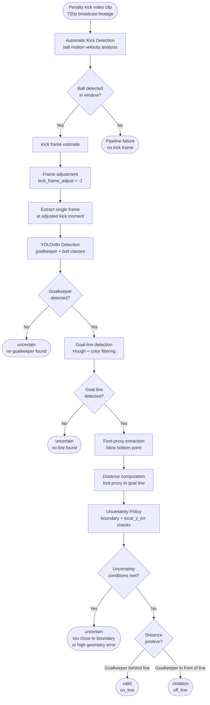
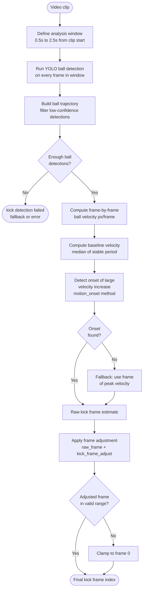
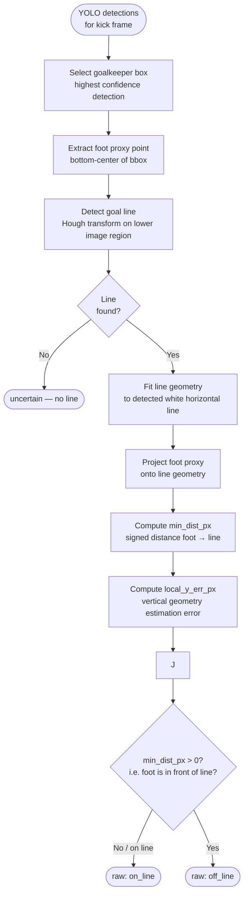
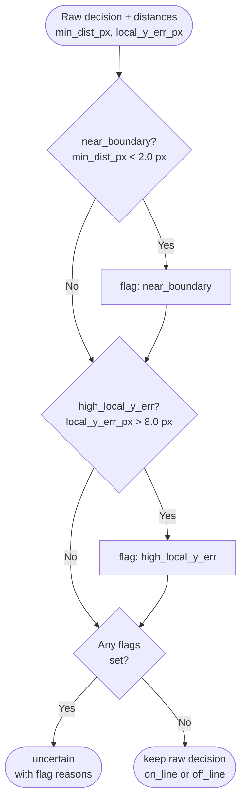
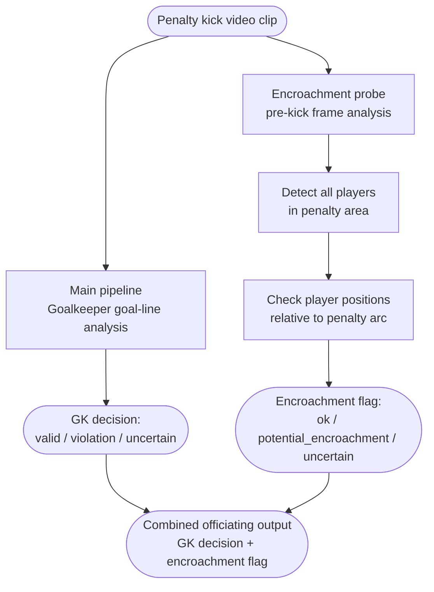

# Pipeline Flowcharts

All diagrams are in Mermaid format. Paste them into any Mermaid renderer
(e.g. mermaid.live, VS Code Mermaid plugin, Typora) to render visually.

---

## 1. Full Goalkeeper Goal-Line Pipeline

---

## 2. Automatic Kick Detection Submodule

---

## 3. Goal-Line Decision Logic

---

## 4. Uncertainty Policy

---

## 5. Extended Pipeline — Combined Officiating (Experimental)

---

## Usage notes

- Diagrams 1–4 cover the final adopted thesis method
- Diagram 5 covers the experimental extension (not part of the main thesis result)
- For the report: Diagram 1 goes in the Methods section overview
- For the report: Diagrams 2–4 go in the respective subsections
- For the presentation: Diagram 1 is the main "architecture" slide
